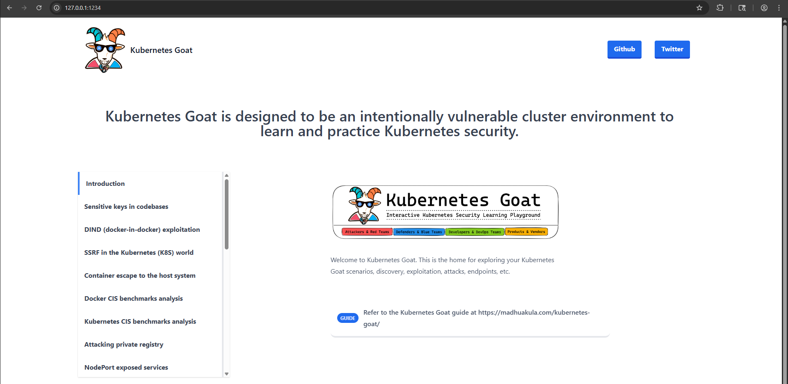
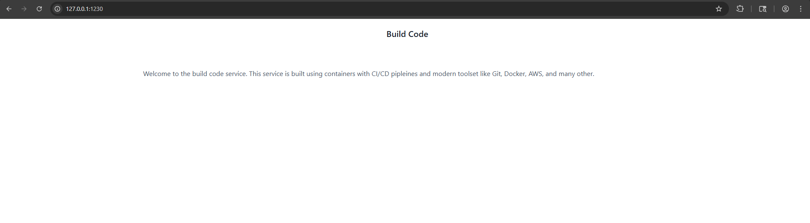
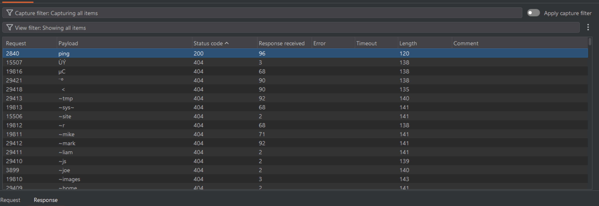
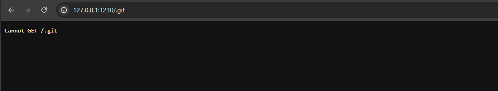
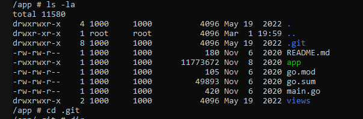
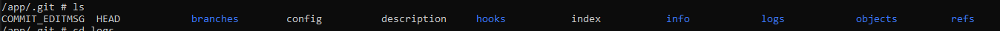
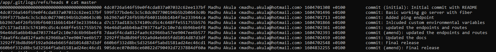
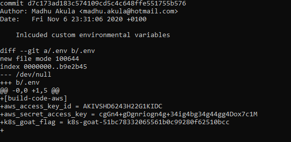

# K8s Pen testing Journey for Beginners

# Lab Setup

This section covers the core infrastructure required to run the **Kubernetes Goat** environment locally.

link:-  https://github.com/madhuakula/kubernetes-goat 

Before starting, ensure the following components are installed and running:

- **Docker Desktop**: The engine used to run containers.
- **Kind (Kubernetes in Docker)**: Tools used to create a local Kubernetes cluster within Docker.
- **Kubectl**: The command-line utility used to interact with the Kubernetes cluster.

Follow the steps to deploy the clusters and vulnerable scenarios ➖

1. Build the local cluster using the kind configuration using PowerShell

```jsx
 kind create cluster --name kubernetes-goat-cluster

```

1. Run the setup script to deploy all vulnerable scenarios (assuming you have already cloned the git repository for the lab)

```jsx
cd C:\WINDOWS\system32\kubernetes-goat\platforms\kind-setup\
.\setup-kind-cluster-and-goat.ps1
```

1. Check if all the the pods are working with the following command - 

```jsx
kubectl get pods -A
```

1. Now, we have to perform port forwarding to access the target 

```jsx
kubectl port-forward deployment/build-code-deployment 1234:80
```

Navigate to [http://127.0.0.1:123](http://127.0.0.1:1230)4 in the browser. This is the landing page or the master control of lab scenario which looks like below:-



# Vulnerable Scenario 1 :- Sensitive keys in codebase

Change the port forwarding to access scenario 1 

```jsx
kubectl port-forward deployment/build-code-deployment 1230:3000
```

Now, access the challenge at http://127.0.0.1:1230



When we see a web app, the obvious choice to go through a web directory brute forcing. I used raft-medium from seclists and it utterly failed.



Upon looking, I found there could be an interesting directory named ./git , so I tried that. 



Looks like the web interface is restricted , in this case we can use kubectl to pivot and gain a shell inside a running container.

listing the pods

```jsx
kubectl get pods 
```

Gain access using the following command with the reference to the relevant pods 

```jsx
kubectl exec -it <YOUR_POD_NAME> -- sh
```

Now list the directories and hidden directories in the container. Ah! There we have the .git directory and hopefully we have the access.





The logs folder is always interesting. Traverse to master file in /app/.git/logs/refs/heads directory and list the contents



Try to enumerate the “Include custom environmental variables” commit. We successfully managed to retrieve the sensitive keys



Note:- Sometimes the git ownership does not allow you to list the commit details. Use the below command to bypass/fix that:- 

```jsx
git config --global --add safe.directory /app/.git
```